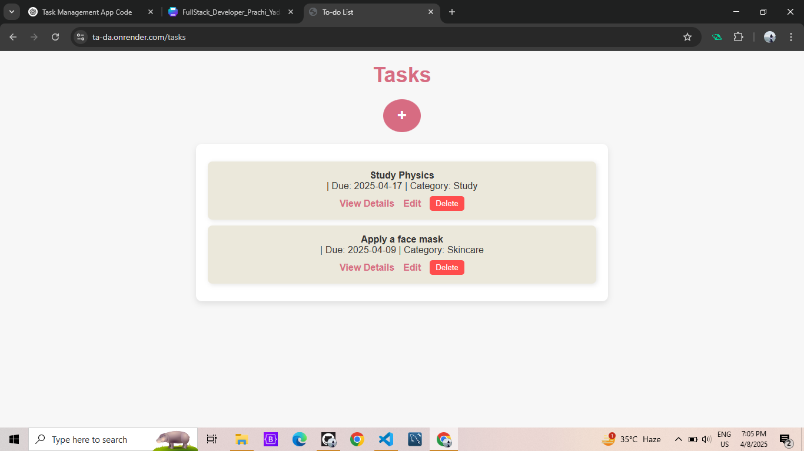

# ✨ Ta-Da ✨

The Task Manager App is a Node.js web application using Express, EJS, and other utilities to manage a simple task list. 🗂️ Users can create, read, update, and delete (CRUD) tasks. Each task includes a description, due date, and category.

---

## 🚀 Features

- 🏠 View a homepage
- 📋 View all tasks
- 🆕 Create a new task
- ✏️ Edit a task
- 🔍 View a single task's details
- 🗑️ Delete a task
- 🗂️ Categories supported: Work, Study, Skincare

---

## 🛠 Tech Stack

- **Backend**: Node.js, Express.js ⚙️
- **Templating Engine**: EJS 🖼️
- **UUID**: Unique task IDs 🔑
- **Method-Override**: Enables PUT and DELETE via forms 🔁
- **dotenv**: Manages environment variables 🌱

---

## 📁 Project Structure

```
project-root/
├── public/             # Static Files
│   └── app.js
│   └── css/
│       ├── edit.css
│       ├── home.css
│       ├── new.css
│       ├── show.css
│       ├── tasks.css
│
├── server/
│   └── index.js            # Main server entry point
|
├── views/                  # EJS templates
│   ├── edit.ejs
│   ├── home.ejs
│   ├── new.ejs
│   ├── show.ejs
│   ├── tasks.ejs
│
├── .env                    # Environment variables (ignored in git)
├── .gitignore              # Files/folders excluded from Git
├── LICENSE
├──package-lock.json        # Auto-generated lockfile for exact dependency versions
├── package.json            # Project metadata and dependencies
└── README.md

```

---

## 🌐 Routes

### GET `/`

- 🏠 Renders the homepage with a list of all tasks.

### GET `/tasks`

- 📋 Displays all tasks.

### GET `/tasks/new`

- 🆕 Form to create a new task.

### POST `/tasks`

- 📩 Handles creation of a new task.

### GET `/tasks/:id`

- 🔍 Shows details of a specific task by ID.

### GET `/tasks/:id/edit`

- ✏️ Displays a form to edit a specific task.

### PATCH `/tasks/:id`

- 🔄 Updates the task information.

### DELETE `/tasks/:id`

- 🗑 Deletes a task from the list.

---

## ⚙️ Setup Instructions

### 1. Clone the Repository

```bash
git clone git@github.com:pprachhiii/todo.git
cd todo
```

### 2. Install Dependencies

```bash
npm install
```

### 3. Create `.env` File

Create a `.env` in the root directory with your credentials:

````env
PORT=3000

### 4. Start the App

```bash
npm start
````

Then go to:  
📍 `http://localhost:5000`

---

### 🔗 Live Demo

Check out the live app here: [Ta-Da](https://ta-da.onrender.com/)

## 📸 Screenshots

### 📋 Weather Page



## 📌 .gitignore Includes

```gitignore
node_modules/
.env
```

---

## 📝 Notes

- 🧠 Task data is stored in memory; restarting the server will reset the task list.
- 🔢 Category values are mapped from numbers to labels: `1 -> Work`, `2 -> Study`, `3 -> Skincare`.

---

## 📬 Contact

Made with ❤️ by **Prachi Yadav**

> Want to contribute or report an issue? Fork this repo or open an issue on GitHub!

## 🪪 License

MIT — Copyright © 2025 Prachi Yadav
See [LICENSE](./LICENSE) for full text.
